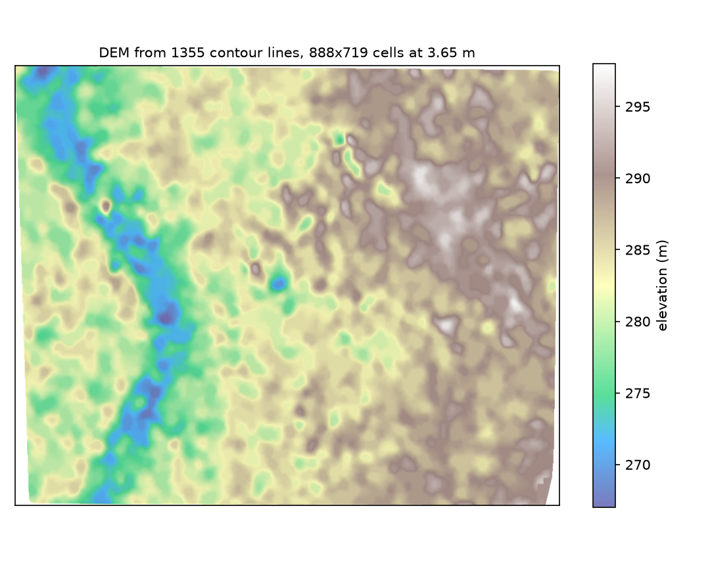
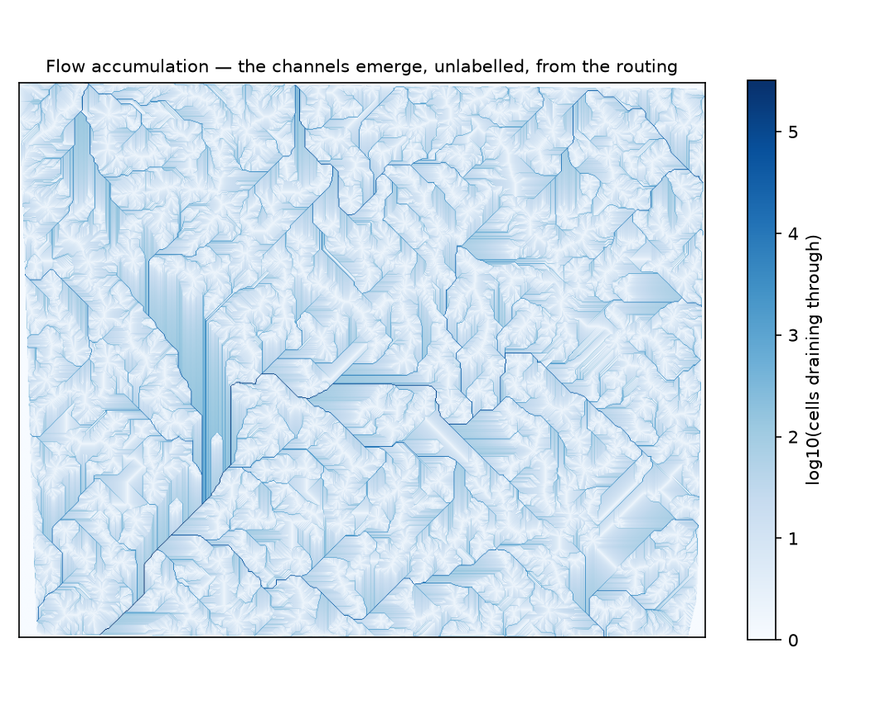
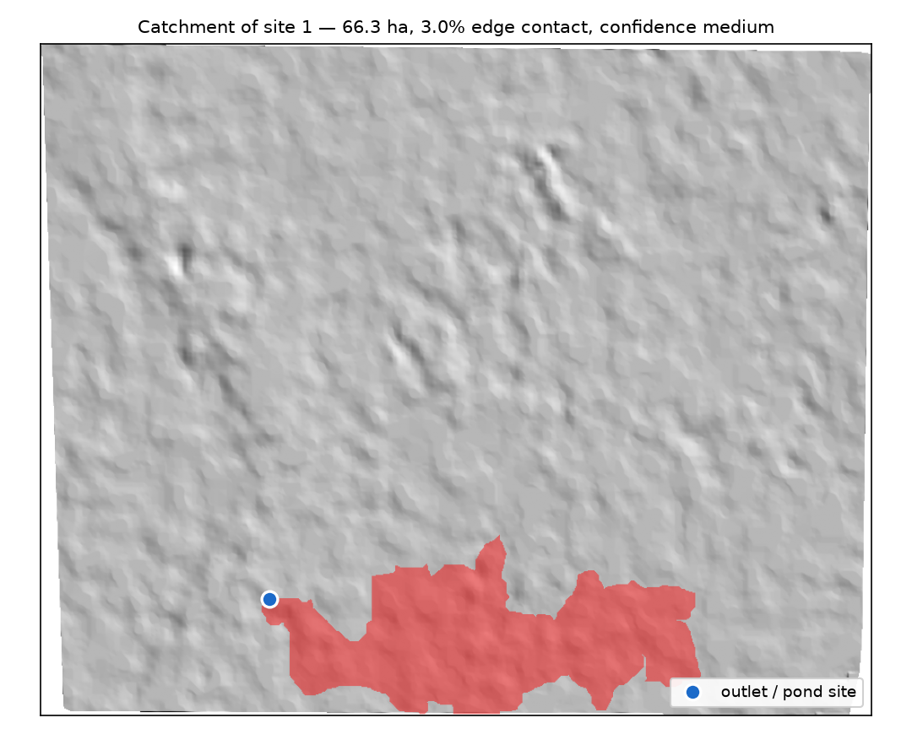
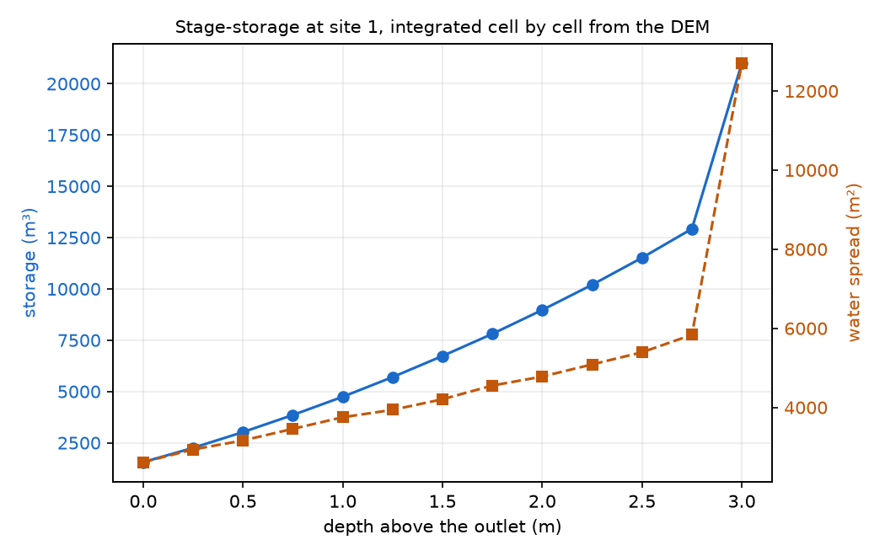

# Pond Catchment Analysis API — Phase 2 Report

**Village Pond Planning System, Phase 2.**
Send a contour map as KML or KMZ. Get back a village pond site, the ground that drains
into it, and how much water that ground delivers in an average year.

| | |
|---|---|
| **Live API** | **http://10.1.75.53:5229** |
| **Interactive API documentation** | **http://10.1.75.53:5229/docs** |
| **Demo page** | **http://10.1.75.53:5229/** |
| **Source** | https://github.com/Akshats-git/Pond-Catchment-Analysis |
| Phase 1 design | `references/HLD_Village_Pond_Planning_System_v1_basic.pdf` |
| Methodology and evidence | [docs/METHODOLOGY.md](docs/METHODOLOGY.md) |
| API reference | [docs/API.md](docs/API.md) |

```bash
curl -F file=@data/contours_1m.kml http://10.1.75.53:5229/api/v1/analyzeContour
```

---

## 1. What was built

A FastAPI service that turns a contour sheet into a costed pond proposal. One endpoint
does the work; two more exist so a client can check liveness and look up rainfall on its
own.

| Method | Path | Purpose |
|---|---|---|
| `POST` | `/api/v1/analyzeContour` | Contour map in; site, catchment, storage and yield out |
| `POST` | `/api/v1/findCatchment` | Alias, identical signature |
| `GET` | `/api/v1/rainfall` | Ten years of daily rainfall for a point |
| `GET` | `/health` | Liveness |

Nothing about the answer is hard-coded to the sample sheet. The grid resolution, the
smoothing width and the stream threshold are all derived from the input file, and no
latitude, longitude or elevation literal exists outside `data/` and `tests/`. A sub-tile
cut out of the sample produces the sub-tile's own answer, not a memory of the full sheet
([METHODOLOGY §5, Test D](docs/METHODOLOGY.md)).

**Stack.** Python 3.12, FastAPI, numpy and scipy — and deliberately nothing else. No
GDAL, no pysheds, no rasterio. The whole terrain engine is about 900 lines of numpy, which
is what lets the service install and run inside a 512 MB container with no system
packages at all.

---

## 2. How the catchment is worked out

Six steps, each of which can be checked on its own.

**1. Contours to height points.** Every vertex of every contour line is a known
`(lon, lat, z)`. The sample gives 159,113 such points across 1,355 lines at 32 distinct
levels. Elevations are read through a cascade — `z` coordinate, then `ExtendedData`, then
the placemark name — so a file that carries its heights in any of the three usual places
is read without being edited first.

**2. Points to a grid.** Coordinates are projected to local metres, then Delaunay
triangulation and linear interpolation put the heights onto a square grid. The cell size
is the mean contour spacing ÷ 4, so the grid follows the detail the map actually carries
instead of a number somebody picked.

**3. Smoothing, which is not cosmetic.** Raw interpolation between contour lines leaves
flat stair-step terraces rather than a hillside, and water runs *along* a terrace instead
of down it. A NaN-aware Gaussian removes them. Against a valley with a provable answer
this step is worth up to **12.79%** of the catchment area — see §4. It is the single
least obvious and most consequential step in the pipeline.

**4. Fill the pits,** so water is never trapped in a hole the interpolation invented
rather than the ground.

**5. Route the water.** D8: each cell drains to its steepest of eight neighbours.
Accumulate over a topological order of the flow graph to get, for every cell, how many
cells drain through it. The drainage network in Figure 2 is not drawn or digitised —
it *emerges* from this step.

**6. Trace the catchment** by walking those flow pointers backwards from the outlet. The
catchment is every cell whose water ends up there.



**Figure 1.** The DEM interpolated from 1,355 contour lines: 719 × 888 cells at 3.65 m.
The Shivnath valley is the blue trough down the left; the high ground to the east reaches
298 m. 2.5% of the frame is no-data, outside the mapped area.



**Figure 2.** Flow accumulation, log scale. Every channel here is a consequence of the
routing in step 5, not an input. This is the network the site search reads.

---

## 3. Where the pond goes, and the rule that matters

Siting starts from the drainage network: find the streams, keep buildable low-slope
ground, rank by how much drains into each spot, and suppress each pick's **whole
catchment** so the alternatives are genuinely separate basins rather than five points
strung along one stream.

One rule is worth stating on its own, because getting it wrong is invisible in the
numbers and obvious on a map.

> Ranking by catchment area alone asks for the cell that the most water passes through.
> On a sheet with a river across it, that cell **is** the river.

The first working version put its top site at 21.241343 N, 81.286758 E — 418.8 ha of an
830.8 ha sheet, outlet standing in the Shivnath. Drawn on satellite imagery, the
recommendation sat in open water. A 3 m structure there is a 2.4 million m³ impoundment
across a live channel: a dam, not a village pond.

The fix is two conditions. Any channel already draining more than **150 ha** is a
watercourse — absolute hectares, never a share of the sheet, or the biggest channel on a
20 ha farm map would be called a river. And a site must stand **3 m above** the
watercourse it drains into, measured along the flow path, which is a pond depth of
freeboard.

**Checked against an independent source.** The OpenStreetMap water layer knows nothing
about this terrain model, so it is a fair judge of whether a candidate stands in water:

| | candidate cells | standing in OSM water |
|---|---|---|
| Stream and buildable only | 2,413 | 310 (12.8%) |
| Plus clear of the watercourse | 566 | **0 (0.0%)** |

The rule is narrow. At 150 ha exactly one line on this sheet qualifies, taking 431 cells
of 638,472. That line is the Shivnath. It removes a river, not the drainage network the
ponds are meant to sit on.

---

## 4. Validation

The methodology is checked against things that can be known independently, not against
its own output. Full detail in [METHODOLOGY §5](docs/METHODOLOGY.md).

### Test A — a valley whose answer can be worked out on paper

The surface `z = 0.05·|x| + 0.01·y` over 1 km × 1 km. Steepest descent is pure −x, so the
catchment of a channel point at `y = Y` is provably `1000 × (1000 − Y)` m². Written out
as a contour KML and read back through the *identical* pipeline:

| Grid | Y = 250 | Y = 500 | Y = 750 |
|---|---|---|---|
| No smoothing (step 3 off) | −4.30% | 0.00% | **−12.79%** |
| **σ = 2.5 m, 5 m grid** | **0.00%** | **0.00%** | **0.00%** |
| σ = 2.5 m, 10 m grid | 0.00% | 0.00% | 0.00% |

The −12.79% has a traceable cause: seven grid rows above the outlet contributed one cell
each instead of 200, because hillslope water ran along a flat stair-step band and entered
the stream *below* the outlet. Smoothing fixes it exactly. This is the evidence for step 3.

### Test B — mass balance on the real map

Every cell drains to exactly one outlet, so the basin areas must sum to the mapped area:

```
sum of all 594 basin areas = 8.3091 km²
mapped area                = 8.3091 km²      difference: 0.000000%
```

No cell is lost, double-counted, or routed into a loop.

### Test C — the resolution ensemble

Each site is delineated again on grids at 5.0, 3.5 and 2.5 m. Grids that agree give
`high` confidence; grids that disagree give `low`, and the site comes back **flagged
rather than reordered away**. This is what turns a bare number into a number with an
error bar, and in the prototype run it caught a site whose 35.7 ha collapsed to
14.1 ± 15.4 ha under re-gridding — an unstable answer that looked perfectly respectable
as a single figure.

### Test suite

```
390 passed in 118.87s
```

Analytic validation, mass balance, structural variants, parser cascades, error mapping.
No test needs the network: the live rainfall fetch is switched off in `conftest.py` and
the Open-Meteo provider is exercised against a payload built in the test.

---

## 5. Demonstration on the provided map

`data/contours_1m.kml`, run through the deployed service with default parameters.

**Input as read:** 1,355 contour lines, 159,113 vertices, 32 levels at a 1.0 m interval,
267–298 m, covering 830.8 ha. One feature carried no readable height and was skipped,
which the response reports rather than hides.

**Grid:** 719 × 888 at 3.65 m, derived from a 14.62 m mean contour spacing. Smoothing
σ = 1.83 m, moving no point by more than 1.155 m.

**Search:** stream threshold 4.2 ha → 6,536 stream cells; 160,890 buildable cells;
230,082 cells clear of the watercourse; **566 candidates** surviving every rule.

### Recommended site

**21.243922 N, 81.289998 E**

| | |
|---|---|
| Catchment | **66.3 ha** (ensemble mean 63.7 ± 17.9 ha, confidence `medium`) |
| Edge contact | 3.0% — the catchment is contained by the sheet, so the area is a measurement, not a floor |
| Relief | 18.0 m, longest flow path 2,270 m, time of concentration 49 min |
| Outlet slope | 1.8% (limit 3%) |
| Height above the nearest watercourse | 4.0 m (rule: ≥ 3 m) |
| Storage at 3 m | **20,993 m³**, water spread 12,699 m² |
| Annual runoff | **73,619 m³/yr** |
| Fill ratio | 3.51 |

The service explains itself rather than just answering:

> - largest upstream area: 66.3 ha, 8% of the mapped sheet
> - buildable slope at the outlet (1.8%, limit 3%)
> - 18 m of relief above the outlet
> - sits 1.2 m below the surrounding ground
> - stands 4.0 m above the nearest watercourse, so the pond is clear of the channel



**Figure 3.** The 66.3 ha catchment traced by walking the flow arrows back from the
outlet (blue). The boundary is a watershed divide, not a drawn shape.



**Figure 4.** Stage-storage at the site, integrated cell by cell off the DEM rather than
assumed from a shape. A frustum approximation of the same pond gives 21,081 m³ against
the integral's 20,993 m³ — 0.4% apart, which is the cross-check that the integration is
not doing something exotic.

### Alternatives

| Rank | Location | Catchment | Confidence | Capacity | Annual runoff |
|---|---|---|---|---|---|
| 1 | 21.243922, 81.289998 | 66.3 ha | medium | 20,993 m³ | 73,619 m³ |
| 2 | 21.251095, 81.303488 | 56.5 ha | high | 682 m³ | 62,708 m³ |
| 3 | 21.251624, 81.301445 | 24.9 ha | high | 146,505 m³ | 27,592 m³ |

Three separate basins, not three points on one stream. The spread in capacity is the
terrain talking: site 2 is a channel position that would have to be dug, site 3 sits in a
natural hollow that holds water almost for free.

### Water, and one mistake worth naming

Rainfall came live from Open-Meteo for the site: **1,397 mm over 118 rain days**, averaged
across ten years of daily ERA5 records.

SCS-CN is an **event** model. Run it on a year of rain as a single storm and it reports a
runoff coefficient of **0.931** — 93% of the rain running off, which no catchment on earth
does. Run it per rain day and sum the days, and it gives **0.079**: 111 mm of runoff from
1,397 mm of rain, of which only 25 days contribute anything at all. That is a factor of
**11.7** between the careless answer and the defensible one, and it is reported in the
response as `single_event_coefficient` and `overestimate_factor` — the wrong number
deliberately kept beside the right one, because a report that only shows the right answer
cannot show why it is right.

At a fill ratio of 3.51, far more water arrives than a 3 m pond here can hold. The honest
engineering conclusion is that **the spillway matters more at this site than the
capacity does**.

---

## 6. API documentation

Interactive documentation is live at **http://10.1.75.53:5229/docs**, generated by
FastAPI from the same pydantic models that serialise the responses — so it cannot drift
from what the endpoint actually returns. The written reference, with every parameter,
every response field, all error codes and `curl` examples, is [docs/API.md](docs/API.md).

Two things worth noting here.

**Errors have one shape, everywhere.**

```json
{"status": "error", "code": "no_buildable_ground",
 "detail": "What went wrong.", "hint": "What to change."}
```

`code` is stable and machine-readable. The HTTP status separates three genuinely
different situations: **400** the file cannot yield an answer, **413** more data than the
service will take on, **422** understood but impossible as asked — including
`no_ground_clear_of_watercourse`, which is not a malformed request but is the same thing
to a client.

**Warnings are not errors.** A 200 response can carry warnings, and on the sample it
carries three: the skipped contour line, the fact that ERA5 reanalysis spreads rain over
more days than a village gauge would record (so the yield is conservative), and the fact
that a 1 m contour interval bounds how precise any depth can possibly be. They are part
of the answer.

---

## 7. Deployment

The service runs on the lab container **`stu68_sys1`**, reachable at
**http://10.1.75.53:5229**. There is no cloud deployment: a running system on the
allocated infrastructure is what the assignment asks for.

```
laptop ──► 10.1.75.53:5229 ──► container 172.17.0.30:5000 ──► uvicorn (0.0.0.0:5000)
```

The forward follows the lab's rule that the SSH port fixes the application ports —
SSH 2229 gives 5229 → 5000. uvicorn binds `0.0.0.0`, never `127.0.0.1`, or the forward
would have nothing to reach.

`run.sh` starts the service under a restart loop and survives disconnection via `setsid`.
Verified end to end from outside the container:

| Endpoint | Result |
|---|---|
| `GET /health` | 200 |
| `POST /api/v1/analyzeContour` (sample KML) | 200, 38 KB, ~15 s |
| `POST /api/v1/findCatchment` | 200 |
| `GET /api/v1/rainfall` | 200, live Open-Meteo, `is_measured: true` |
| `GET /` (demo page) | 200 |
| `GET /docs`, `GET /openapi.json` | 200 |
| `POST` with no file | `{"status":"error","code":"invalid_request",...}` |

### The one constraint worth reporting

The container is capped at **512 MB** of memory. A single-grid analysis peaks at about
300 MB and fits comfortably. The four-grid ensemble peaks at **581 MB** and does not.

That cap turned out to be an availability problem rather than a feature problem, and it
took two changes to close. Both were found by testing the deployed service, not by
reading the code.

**Two analyses at once killed the service.** Not "ran slowly" — the second request did
not queue, both peaked together, the kernel killed the worker they shared, and *both*
clients got an empty reply. A grader double-clicking would have done it. Analyses are now
bounded by `APIConfig.max_concurrent_analyses`, default 1, and further requests queue.
Three concurrent uploads of the sample now return 200 in 15 s, 27 s and 39 s with no OOM
at all. Serialising costs little even where memory is plentiful: the analysis is several
seconds of numpy holding the GIL in places, so a parallel second one was never getting a
whole core anyway.

**An explicit `ensemble=true` killed it too.** A grader reading `/docs` sees `ensemble` as
a documented parameter and may well try it. `POND_API_ALLOW_ENSEMBLE=false` now makes that
request return a `422 ensemble_unavailable` naming the limit, instead of taking the worker
down to find out. "Off unless you ask" and "not available on this host" are different
answers, and a client deserves to be told which one it got.

So the ensemble is off on this deployment — `POND_API_DEFAULT_ENSEMBLE=false` — and
responses served from the container carry no cross-resolution error bar. Everything else
is unchanged, and the ensemble figures quoted in §4 and §5 come from the same code run
where the memory is available.

This is a property of the container, not of the code. PLAN Phase 11 anticipated a 512 MB
ceiling and capped `grid_resolution` server-side for exactly this reason. What it did not
anticipate is that the memory limit would show up first as *two requests* rather than one.

### Staying up

`run.sh` restarts uvicorn if anything kills it, takes a `flock` so a second launch is a
no-op rather than two supervisors racing for one port, and truncates its own log at 20 MB.
The cgroup's `memory.oom.group` is 0, so an OOM kills the Python worker and leaves the
supervising shell alive to restart it — which is why the restart loop works at all.

The gap that remains: the container has no cron and no systemd (PID 1 is sshd), so
**nothing brings the service back if the container itself is restarted**. That container
has been up 31 days, so it is unlikely rather than impossible. Recovery is one command:

```bash
ssh -p 2229 student@10.1.75.53
setsid ~/PondCatchmentAnalysis/run.sh >/dev/null 2>&1 </dev/null &
```

---

## 8. Code reusability, and the road to Phase 3

The layering exists so Phase 3 changes one file at a time. `app/core/` holds the
analysis, `app/providers/` the swappable data sources, `app/routers/` the HTTP surface
only, and `app/pipeline.py` is the single place they are wired together.

| Phase 3 requirement | Seam already in place |
|---|---|
| DEM from an elevation API instead of KML | `providers/elevation.py` — the pipeline takes a DEM, not a KML file |
| Real rainfall | `providers/rainfall.py` — already swapped once, from a constant to Open-Meteo, behind an unchanged `RainfallProvider` interface |
| Larger regions, different CRS | `Projection` interface — swap local ENU for UTM |
| Faster or GPU flow routing | `TerrainEngine` interface — pysheds drops in behind it |
| Persisting results | `pipeline.py` returns a plain dataclass, trivially serialisable |
| Land-availability masks (the OpenCV service) | siting already takes an optional `exclusion_mask` |

The rainfall seam is the one that has been proven rather than promised: Phase 2 shipped
with a documented constant, Phase 3's live Open-Meteo feed replaced it, and nothing
outside `providers/rainfall.py` had to change. Every tunable in the system lives in
`app/config.py` with its rationale written next to it, and every one is overridable from
the environment with a `POND_` prefix — which is how the ensemble was switched off for
this deployment without touching a line of code.

---

## 9. Honest limitations

- **Terrain is not tenure.** The model says where water collects. It cannot say whether
  that spot is a house, a road, or a field somebody owns. Siting takes an
  `exclusion_mask` for exactly this, and Phase 3's land-availability service is what
  should fill it.
- **Rainfall is reanalysis, not a gauge.** ERA5 on a ~25 km grid spreads rain over more
  days than a village gauge records. Runoff grows faster than rainfall, so the reported
  yield is on the conservative side. Check it against the nearest real gauge before
  costing a design.
- **A 1 m contour interval bounds everything downstream.** No depth in the output is
  better than about a metre, whatever the number of decimal places suggests.
- **Edge contact above 15% means a lower bound,** not a measurement: the catchment
  carries on beyond the sheet. The recommended site here is at 3.0%, so this does not
  apply to it — but the field is in every response because on another sheet it will.
- **The ensemble does not run on this container.** See §7.

---

## 10. Rubric

| Item | Marks | Where it is |
|---|---|---|
| Working API URL | 5 | http://10.1.75.53:5229 — §7, verified end to end |
| Catchment Analysis / Estimation | 10 | §2 method, §4 validation (0.00% analytic error, 0.000000% mass balance), §5 demonstration |
| Report | 3 | This document, with [docs/METHODOLOGY.md](docs/METHODOLOGY.md) and [docs/API.md](docs/API.md) |
| Code Reusability | 2 | §8 — `core/` + `providers/` seams, one already proven by the rainfall swap |
