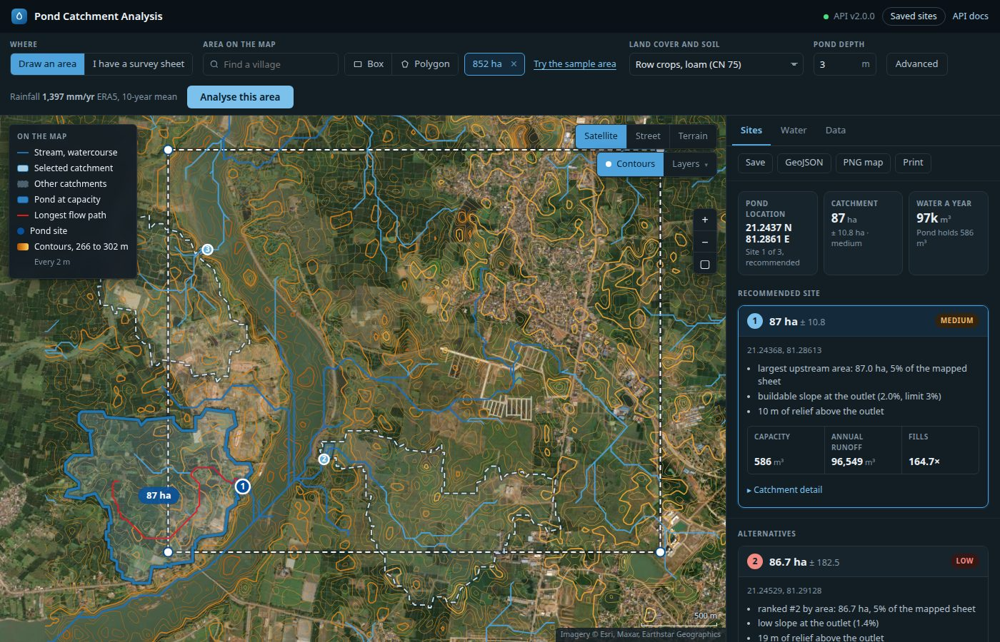
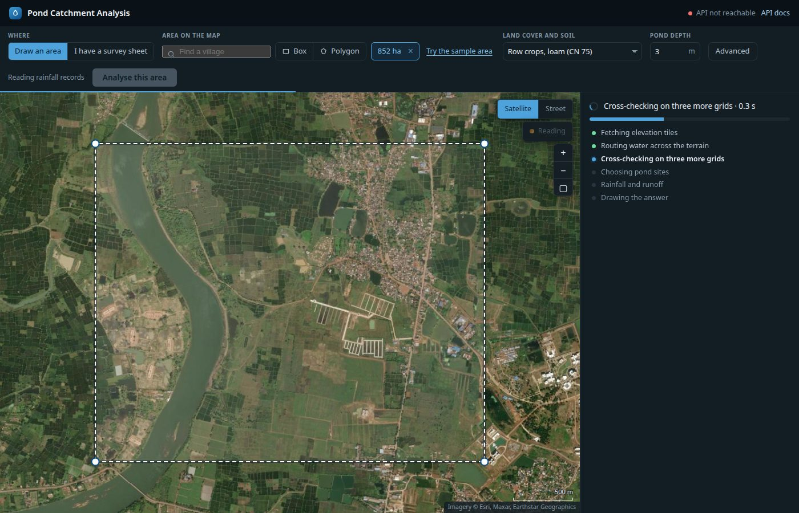
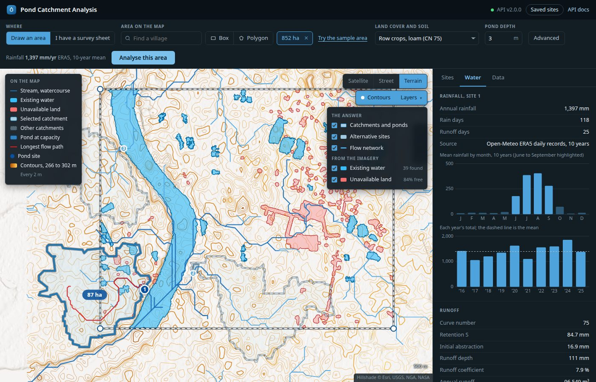
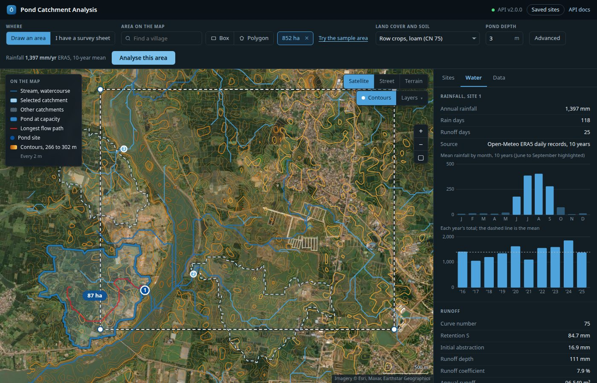
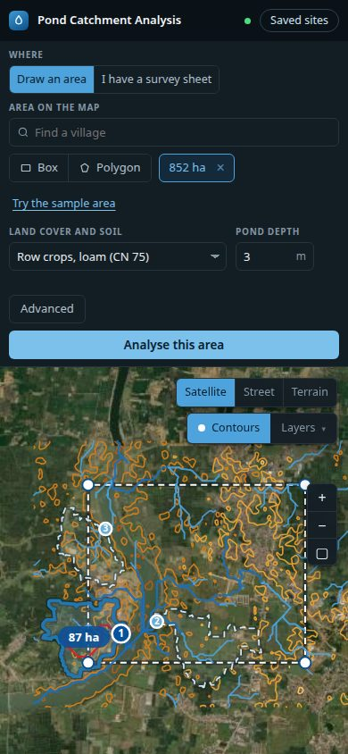

# Village Pond Planning System — Phase 3 report

**The complete product: choose land on a map, get a pond site, its catchment and its
water, on that map.** Phase 2 built and validated the analysis for an uploaded contour
survey. Phase 3 gives it a map-first front door, free elevation data so no survey is
needed, the scaling half of the brief measured on 512 MB containers, and the HLD's
remaining functional requirements.



*The provided survey sheet's rectangle, drawn on the map and analysed from free SRTM
tiles in half a second: the recommended pond (1) with its 87 ± 10.8 ha catchment, two
alternatives, the flow network in blue, and contours generated from the DEM. The dashed
white line is the selection; catchments crossing it are counted in full.*

---

## 1. What the brief asked for, and where it is

| The brief | Where | Evidence |
|---|---|---|
| A fully working front-end | `static/index.html`: one file, no build step, no CDN | §4, browser-tested at 1400 px and 390 px |
| Select the land area on a map | Box and polygon tools, draggable corners, live area, village search | §4 |
| Results from the selected area | `POST /analyzeArea`, `POST /jobs`: SRTM tiles → DEM → the Phase 2 analysis | §2 |
| Suggested pond location | Ranked sites, kept inside the selection and 3 m clear of watercourses | §2 |
| Catchment area | Traced on the DEM, with an error bar from three more grids | §3 |
| Expected water volume | Ten years of daily rainfall, SCS-CN per rain day, stage-storage | §3, §7 |
| Overlaid on the map | Catchments, ponds, flow network, contours, imagery layers; GeoJSON and PNG export | §4 |
| Fast and functional | 0.5 s for the sample area; a repeat in 10 ms | §5 |
| Stress, scaling, limits, four systems | Gateway + three workers, each capped at 512 MB, measured | §5 |

| HLD requirement | Phase 3 |
|---|---|
| FR-2 Generate and visualise contours from the DEM | `app/core/contouring.py`, `POST /contours` with `bbox` |
| FR-3 Vacant land suitable for excavation | `POST /land/available`; `avoid_unavailable_land` keeps the pond off it |
| FR-9 Persist analysed sites | `/api/v1/ponds`, SQLite on the gateway |
| §6.8 Existing-pond detection | `POST /imagery/detectPonds` |
| NFR One-command stack | `docker compose up`: frontend, gateway, 3 workers, CV, database volume |
| NFR Cache DEM and rainfall; heavy jobs async | Tile cache (memory → committed seed → disk), rainfall cache, result cache; job API |

## 2. The seam held

Phase 2 was built so that everything downstream of the DEM takes a `DEM` object and never
the file it came from. Phase 3 is the test of that. `RasterSurface` builds the same `DEM`
from elevation tiles, and flow routing, catchment delineation, siting, runoff, GeoJSON and
the renderer run on it **without a line of change**. The new work sits either side:

```
Phase 2:  KML upload ─► parse ─► ContourSurface ─┐
                                                 ├─► DEM ─► [ flow ─► catchment ─► siting ─► runoff ─► GeoJSON ]
Phase 3:  bbox/polygon ─► tiles ─► RasterSurface ┘                (unchanged)
```

Three decisions on the new side decide whether the answer is right
([METHODOLOGY.md §8](METHODOLOGY.md)):

- **A margin around the selection.** The DEM covers the selection plus 25% on every side;
  the pond is kept inside what was drawn through the exclusion mask Phase 2 already had.
  Without it, every catchment reaching the drawn line would be silently truncated.
- **Adaptive resolution.** The grid coarsens rather than pass a million cells, the envelope
  a 512 MB worker is known to hold; past 100 km² the request is a named 422.
- **Smoothing chosen by measurement.** SRTM heights are whole metres, a staircase D8
  cannot route; sigma 8 m was picked from a sweep against the survey (§3).

The elevation source is the AWS terrain-tile bucket: free, keyless, reachable from the
lab. The demo region is committed with the repository (1.6 MB), so the demo runs with the
network down.

## 3. How far the free data can be trusted

The provided survey is the only ground truth available, and both paths were run over it
([VALIDATION.md](VALIDATION.md), regenerated by `python -m docs.validate_two_path`):

| | 1 m contour survey | 30 m SRTM, drawn as an area | Δ |
|---|---|---|---|
| Elevation range | 267–298 m | 266–298 m | 1 m |
| DEM agreement | — | RMSE 0.26 m, r = 0.999 | |
| Recommended pond | 21.24392 N, 81.29000 E | 21.24368 N, 81.28613 E | 402 m, same valley |
| Its catchment | 66.3 ha | 87.0 ha | +31% |
| Best-matching catchment | — | IoU 0.53 with the survey's | |
| Annual runoff | 127,040 m³ | 166,610 m³ | +31% |
| Grid / time with ensemble | 638,472 cells, 10 s | 60,606 cells, 0.49 s | 21× faster |

Read honestly: DEMs that agree to 0.26 m mean the survey sheet was itself drawn from
SRTM-class data, so this validates the *data path* (decoding, reprojection, the margin,
routing on a coarser grid), not SRTM against a field survey. Where the answers differ,
resolution is why: 17.8 m against 3.1 m moves a confluence, and with it which cells drain
where. The same sweep rejected zoom 12, which moved the site 1.7 km into another valley.

The analytic valley (Phase 2's Test A) and the mass balance (Test B) were re-run through
the raster path and pass: the raster path satisfies the same invariants as the contour
path.

## 4. The front-end

The Phase 2 page, extended rather than replaced. The custom map already carried
satellite and street tiles, contours and overlays; adding the draw tools cost far less than
porting to Leaflet would have, and kept a CDN off the critical path of a live demo.

- **Choosing land.** *Draw an area* is the default; *I have a survey sheet* is the second
  tab, framed as the more accurate path. Village search (Nominatim, proxied and cached),
  box and polygon tools, draggable corners, a live area readout checked against the limits
  `/health` reports, and **Try the sample area** for a result in one click.
- **Progress that means something.** Area analyses run as jobs, and the bar reports the
  stage the analysis is actually in, from fetching tiles to drawing the answer.
- **The answer.** Three headline tiles (location, catchment, water a year), ranked sites
  with the reasons that chose them, a rainfall chart (monthly means with the monsoon
  highlighted, ten years of annual totals against the mean) and the stage-storage curve,
  all drawn as SVG by hand.
- **Layers.** Satellite, street or terrain basemap; contours; catchments and ponds;
  alternatives; flow network; existing water and unavailable land from the imagery.
- **Out.** Save and reopen analyses, GeoJSON of every layer, the PNG map, a print view,
  and a layout that works at phone width.







## 5. Stress, scaling and the four systems

**Deployment shape.** One image, two roles. A process with `POND_JOBS_WORKERS` set is the
gateway: job store, result cache, dispatch, saved sites. Without it, it is a worker and
runs analyses itself, one at a time, because two at once on 512 MB kill both (Phase 2's
finding). On the lab: gateway on sys1 at the Phase 2 URL, workers on sys2-4
(`deploy/deploy.sh`). Locally: the same topology in `docker compose`, every container
capped at 512 MB.

**Measured** ([SCALING.md](SCALING.md), regenerated by `python -m tools.scaling`), mixed
village and 20 km² selections, every request computed, ensemble on:

| workers | throughput | p50 | p95 | peak worker memory |
|---|---|---|---|---|
| 1 | 1.34 req/s | 4.11 s | 7.65 s | 204 MiB |
| 2 | 2.10 req/s | 2.60 s | 4.50 s | 220 MiB |
| 3 | 3.54 req/s | 1.17 s | 2.99 s | 224 MiB |

- **2.6× from one worker to three.** The queue, not a worker, absorbs a burst.
- **Least-busy against round-robin:** the same throughput, p95 9% lower and p99 12% lower
  for least-busy, which never sends a job to a busy worker while another is idle. Modest at
  three workers; it is the spread of job sizes that makes it matter.
- **Cache:** the sample area in 2.07 s cold, 10 ms warm.
- **At the limits:** a 100+ km² selection is a `422 aoi_too_large` in 25 ms; 24 large
  selections at once against a queue of 4 gave 7 answers and 17 immediate `503 busy`, not
  24 timeouts; the largest selection tried (93 km², 660,000 cells) answered in 2.4 s.
- **Memory:** peak 276 MiB of 512 across the whole matrix. The map path's grids are ten
  times smaller than the contour path's, so the resolution ensemble, switched off on the
  lab since Phase 2 because it did not fit, runs on every map-path request.

## 6. Imagery: existing ponds and available land

Satellite imagery (Esri, ~2 m) classified by colour and texture rules in numpy and scipy:
no OpenCV, no new dependency. The rules were measured on the sample area rather than
assumed, and the measurement overturned the textbook one: village ponds here are *green*,
with the same excess-green index as paddy. What separates them is that they are
glass-smooth and slightly bluer. On the sample sheet: 39 water bodies including the
river and every visible village pond, 4.5% built-up, 84% free. It is a screening layer
and every response says so ([METHODOLOGY.md §9](METHODOLOGY.md)). It runs in-process, or
as its own service (the HLD's container 3) in compose.

## 7. Limitations

- **Storage on the map path is not design-grade.** Whole-metre SRTM heights put tiny
  ridges round every hollow, so the stage-storage curve spills early: the sample site
  holds 586 m³ on the map path where the survey's site in the same valley holds 20,993 m³.
  Catchment and runoff are usable for choosing a site; the pond's capacity needs a survey.
  The response says so.
- **Catchments are approximate** at 17.8 m (IoU 0.53 with the survey's), and grow less
  certain on flat ground, which is what the ensemble's confidence reports.
- **The imagery layer is rules, not a model.** Flooded paddies can read as water; tree
  cover is not separated from crops at this resolution.
- **SRTM's own accuracy against the ground is not measured here**, because nothing in this
  project is independent of it (§3).
- **Not yet deployed to the lab.** The deploy scripts, the gateway/worker roles and the
  Go-balancer comparison are ready (`deploy/`); the Phase 2 service still answers at
  http://10.1.75.53:5229, and the scaling matrix above was measured on docker compose
  under the lab's memory cap, not on the lab's own four containers.

## 8. Reproducing everything

```bash
docker compose up -d --build           # the system, at http://localhost:5229
pytest                                 # 588 tests, no network
python -m docs.validate_two_path       # docs/VALIDATION.md
python -m tools.scaling                # docs/SCALING.md, against the compose stack
```
